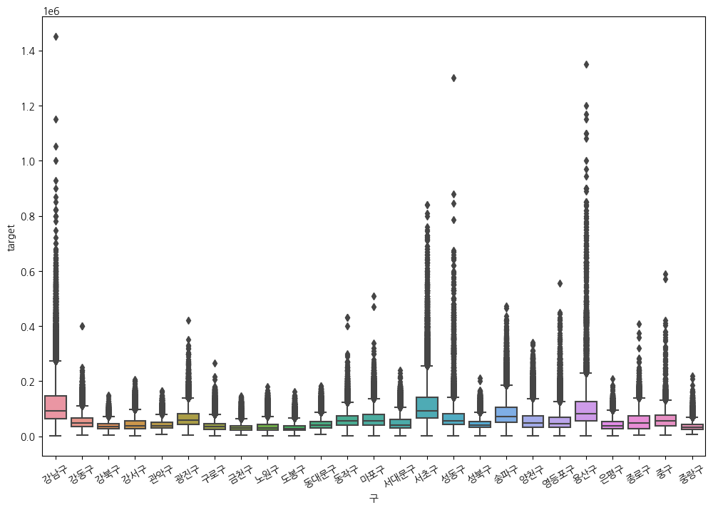
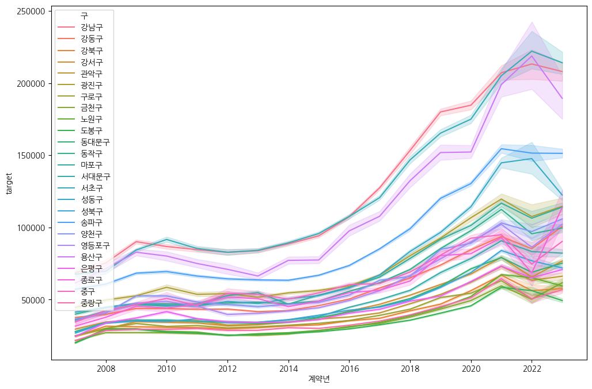
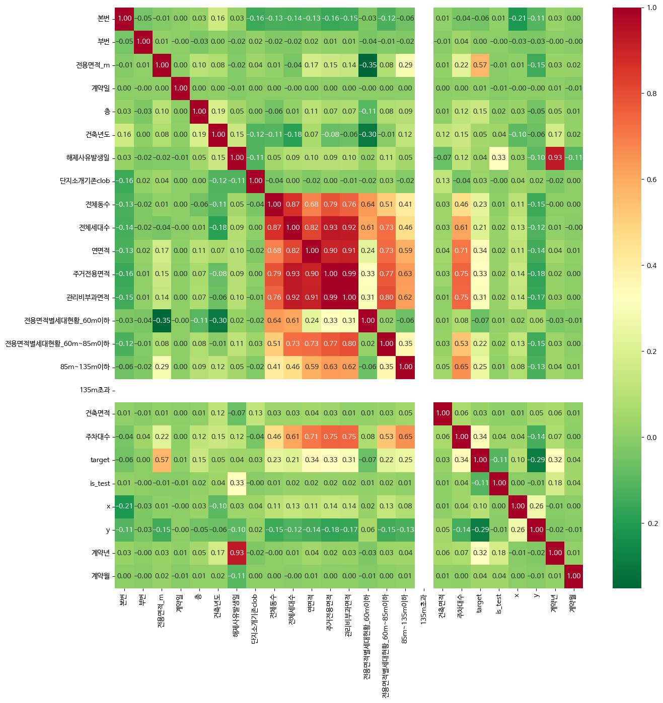
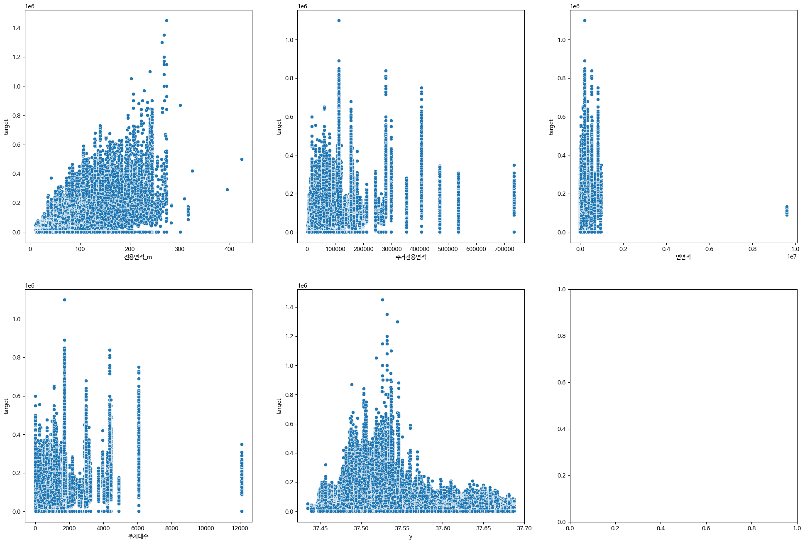
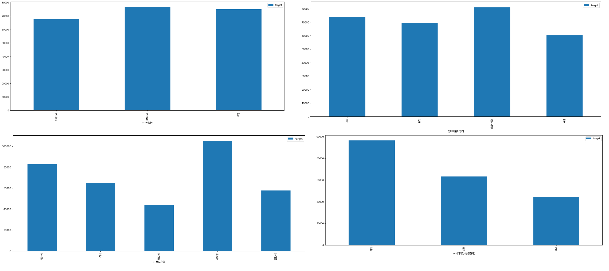
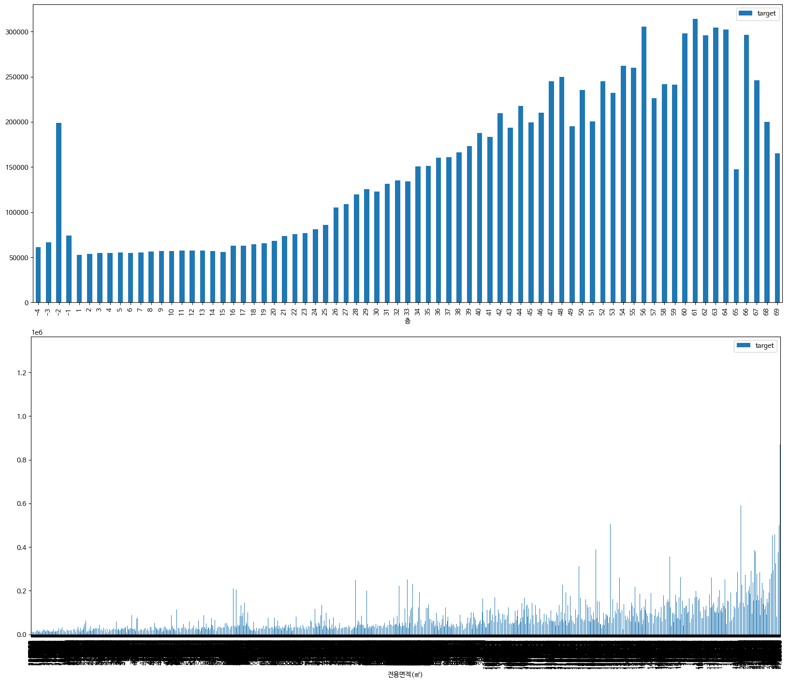
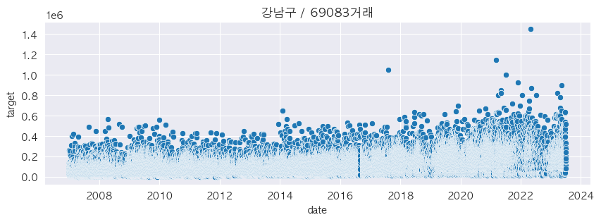
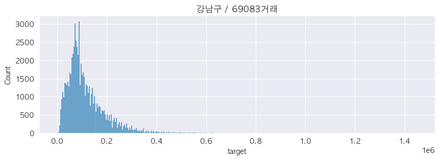
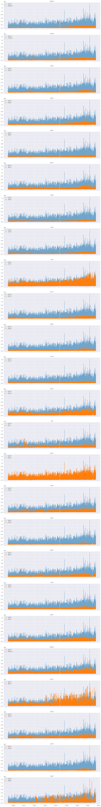
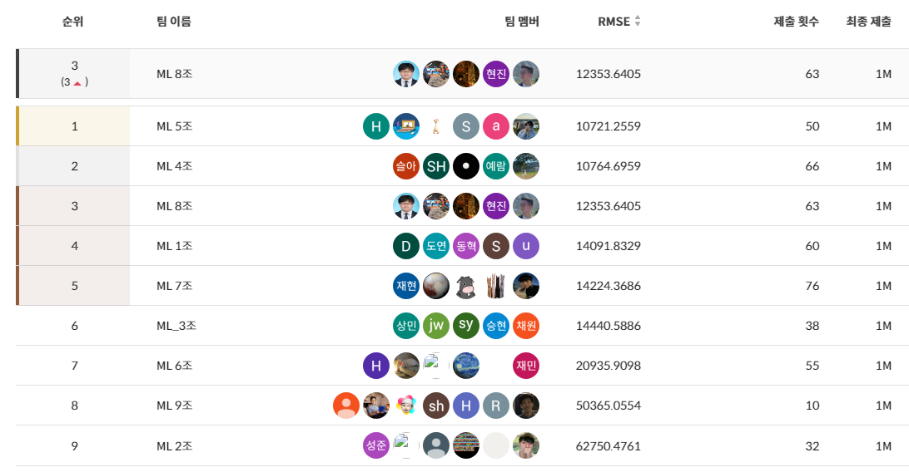

[](https://classroom.github.com/a/g6ZC_OOE)
# 업스테이지 서울 아파트 가격 예측 8조

## Team 8

|  |  |  |  |  |
| :--------------------------------------------------------------: | :--------------------------------------------------------------: | :--------------------------------------------------------------: | :--------------------------------------------------------------: | :--------------------------------------------------------------: |
|            [김소현](https://github.com/UpstageAILab)             |            [권혁찬](https://github.com/UpstageAILab)             |            [김태한](https://github.com/UpstageAILab)             |            [문정의](https://github.com/UpstageAILab)             |            [이현진](https://github.com/UpstageAILab)             |
|                            팀장, EDA, 피쳐 엔지니어링, 모델링                             |                            EDA, 피쳐 엔지니어링, 모델링                             |                            EDA, 피쳐 엔지니어링, 모델링                             |                            EDA, 피쳐 엔지니어링, 모델링                             |                            EDA, 피쳐 엔지니어링, 모델링                             |

## 1. Competiton Info

### Overview

- House Price Prediction 경진대회는 주어진 데이터를 활용하여 서울의 아파트 실거래가를 효과적으로 예측하는 모델을 개발하는 대회입니다. 

- 저희는 이러한 목적 하에서 다양한 부동산 관련 의사결정을 돕고자 하는 부동산 실거래가를 예측하는 모델을 개발하는 것입니다. 특히, 가장 중요한 서울시로 한정해서 서울시의 아파트 가격을 예측하려고 합니다.

### Timeline

- January 15, 2024 - Start Date
- January 25, 2024 - Final submission deadline


### Evaluation

- RMSE(Root Mean Squared Error)

## 2. Components

### Directory

Project<br>
.<br>
├── code<br>
│   └── final.ipynb<br>
├── docs/pdf<br>
│   └── 아파트가격예측모델_8조.pptx<br>
│   └── 아파트가격예측모델_8조.pdf<br>
├── image<br>
│   └── (images to write md file)<br>
├── src<br>
│   ├── bus_feature.csv<br>
│   ├── include_xy.csv<br>
│   ├── interest_rate.csv<br>
│   ├── subway_feature.csv<br>
│   ├── test.csv<br>
│   └── train.csv<br>
└── README.md<br>

## 3. Data descrption

### Dataset overview

<br>
- 학습 데이터는 아래와 같이 1,118,822개이며, 예측해야 할 거래금액(target)을 포함한 52개의 아파트의 정보에 대한 변수와 거래시점에 대한 변수.
- 주요 데이터는 .csv 형태로 제공되며, 서울시 아파트의 각 시점에서의 거래금액(만원)을 예측이 목표
- 학습 데이터의 기간은 2007년 1월 1일부터 2023년 6월 30일
- 테스트 데이터의 기간은 2023년 7, 8, 9월. Puiblic과 Private은 각각 Random하게 5:5로 나뉜다.
- 변수 
- 연속형 변수:
  '전용면적', '계약년월', '계약일', '층', '건축년도', 'k-전체동수', 'k-전체세대수', 'k-연면적',
  'k-주거전용면적', 'k-관리비부과면적', 'k-전용면적별세대현황(60㎡이하)', 'k-전용면적별세대현황(60㎡\~85㎡이하)',
  'k-85㎡\~135㎡이하', '건축면적', '주차대수', '좌표X', '좌표Y', 'target'
- 범주형 변수:
  '시군구', '번지', '본번', '부번', '아파트명', '도로명', 'k-단지분류(아파트,주상복합등등)', 'k-전화번호',
  'k-팩스번호', 'k-세대타입(분양형태)', 'k-관리방식', 'k-복도유형', 'k-난방방식', 'k-건설사(시공사)', 'k-시행사',
  'k-사용검사일-사용승인일', 'k-수정일자', '고용보험관리번호', '경비비관리형태', '세대전기계약방법', '청소비관리형태',
  '기타/의무/임대/임의=1/2/3/4', '단지승인일', '사용허가여부', '관리비 업로드', '단지신청일'


<br>각 데이터에 대한 결측 비율 그래프

### EDA

#### 김태한
- 구별 아파트 가격의 Boxplot
  
- 구별 연도에 따른 아파트 가격 추이 Plot


#### 이현진
1. 연속형 변수에 대한 변수 간 상관관계 확인<br>

2. 'target'과 상관관계가 높은 변수 확인<br>


#### 김소현
1. 각 feature들에 따라 target 값에 연관이 있는지 확인<br>
<br>
관리방식, 복도유형, 세대타입, 경비비관리형태 등의 feature는 target 값에 큰 영향을 미치지 않는 것처럼 보임.


#### 권혁찬
1. 전체기간 거래일에 따른 구별 target 변화 추이 Line 그래프<br>

2. 전체기간 거래일에 따른 구별 target Histogram 그래프<br>

3. 전체기간 거래일에 따른 구별 target Line 그래프 비교(기준:강남구)<br>


### Feature engineering

#### 김태한
- 아파트 전용면적에 따른 클래스 생성 후 추가 
```python
def class_area(data):
    if data < 40: #16평 이하
        result = 'small'
    elif data >= 40 and data < 61: #16~24평
        result = 'mid-small'
    elif data >= 61 and data < 86: #24~33평
        result = 'middle'
    elif data >= 86 and data < 132: #34~40평
        result = 'mid-large'
    elif data >= 132 and data < 166: #41~50평
        result = 'large'   
    else: # 51평 이상
        result = 'huge'
    return result
```
- 엄효범님 코드에서 아이디어를 얻어, 추론할 y값을 아파트 전용면적 클래스 별 평균값으로 대체 
```python
train_x['price'] = train_x.groupby(['area_class'])['target'].transform('mean')
```
#### 이현진
1. 한국은행 기준금리 feature 추가<br>
```python
with open('../data/interest_rate.csv') as f:
    interest = pd.read_csv(f)
t = interest
t = t.astype('str')
interest.loc[:,'datetime'] = t['year'] + t['month'].apply(lambda x: '0'+x if len(x) == 1 else x) + t['date'].apply(lambda x: '0'+x if len(x) == 1 else x)
interest.sort_values(by = ['year','month','date'], ascending=True, inplace = True)
interest.reset_index(inplace=True)
interest.drop(columns = 'index', inplace = True)
import datetime
df['interest_rate'] = [-1] * len(df)
for i in range(len(df)):
    contract_date = str(df.loc[i,'계약년']) + '-' + str(df.loc[i, '계약월'])+ '-'+ str(df.loc[i,'계약일'])
    contract_date = datetime.datetime.strptime(contract_date, '%Y-%m-%d')
    for j in range(len(interest)-1):
        compare_date1 = datetime.datetime.strptime(interest.loc[j,'datetime'], '%Y%m%d')
        compare_date2 = datetime.datetime.strptime(interest.loc[j+1,'datetime'], '%Y%m%d')
        if (compare_date1<=contract_date) and (contract_date < compare_date2):
            df.loc[i, 'interest_rate'] =  interest.loc[j, 'rate']
            break
df.loc[:,'interest_rate'] = df['interest_rate'].apply(lambda x : 3.5 if x == -1 else x)
```

2. 역세권 여부 feature 추가<br>
```python
with open('../data/subway_feature.csv') as f:
    subway_df = pd.read_csv(f)

def subway_distance(x, y):
    y_building = y
    x_building = x
    for i in range(len(subway_df)):
        x_subway = subway_df.loc[i, '경도']
        y_subway = subway_df.loc[i, '위도']

        x_distance = abs(x_building - x_subway)
        y_distance = abs(y_building - y_subway)

        #위도 경도 변환
        x_distance = 88000 * x_distance
        y_distance = 110000 * y_distance

        distance = np.sqrt(x_distance ** 2 + y_distance ** 2)
        if distance <= 500:
            return 1

    return 0

tmp = train.progress_apply(lambda row : subway_distance(row['x'], row['y']), axis = 1)
df['is_subway'] = tmp
```

3. 강남여부 feature 추가<br>
```python
def gangnam_parser(x):
    gu_li = ['강서구', '영등포구', '동작구', '서초구', '강남구', '송파구', '강동구']
    if x.split(' ')[1] in gu_li:
        return 1
    else:
        return 0

df.loc[:,'is_gangnam'] = df['시군구'].apply(gangnam_parser)
```

#### 김소현
1. 좌표X와 좌표Y를 카카오맵API를 통해 보충<br>
```python
dt_test_left_join = pd.merge(dt_test, add_na_df_test_final, left_on=['시군구', '번지', '아파트명'], right_on=['시군구', '번지', '아파트명'], how='left')

def OverWrite(pos1, pos2) :
    if pd.isna(pos2) == True :
        return pos1
    else :
        return pos2

dt_test_left_join['좌표X'] = dt_test_left_join.apply(lambda x : OverWrite(x['좌표X_x'], x['좌표X_y']), axis=1)
dt_test_left_join['좌표Y'] = dt_test_left_join.apply(lambda x : OverWrite(x['좌표Y_x'], x['좌표Y_y']), axis=1)
```

2. 고층여부 feature 추가<br>
```python
def is_high_floor(floor) :
    if floor < 0 :
        return -1
    elif floor >= 0 and floor <= 25 :
        return 0
    elif floor > 25 and floor <= 33 :
        return 1
    elif floor > 33 and floor <= 49 :
        return 2
    elif floor > 49 and floor <= 67 :
        return 3
    else :
        return 4

concat_select['고층여부'] = concat_select['층'].apply(is_high_floor)
```

3. 청소비관리형태 그룹화
```python
def define_wash_fee(fee) :
    if fee == '위탁+직영' :
        return 2
    elif fee == '위탁' or fee == '직영' :
        return 1
    else :
        return 0

concat_select['청소비관리형태통합'] = concat_select['청소비관리형태'].apply(define_wash_fee)
```


#### 권혁찬
1. 계약년월, 계약일을 활용한 Date 피처 생성 및 시계열 정렬<br>
```python
TEST_INDEXER = None

# train data를 시계열로 정렬
df_train['date'] = df_train['계약년월'].astype('str')+df_train['계약일'].astype('str')
df_train['date'] = pd.to_datetime(df_train['date'], format='%Y%m%d')
df_train = df_train.sort_values(by='date')
df_train = df_train.set_index('date')
print(df_train.index[0],'~',df_train.index[-1],' / ',df_train.shape)

# test data를 시계열로 정렬
df_test['test_indexer'] = [i for i in range(df_test.shape[0])]
df_test['date'] = df_test['계약년월'].astype('str')+df_test['계약일'].astype('str')
df_test['date'] = pd.to_datetime(df_test['date'], format='%Y%m%d')
df_test = df_test.sort_values(by='date')
df_test = df_test.set_index('date')
TEST_INDEXER = df_test['test_indexer'].copy()
del df_test['test_indexer']
print(df_test.index[0],'~',df_test.index[-1],' / ',df_test.shape)
```

2. 전용면적의 구간별 피처 생성<br>
```python
    df = df.assign(**{'전용면적(㎡)': df['전용면적(㎡)'].round().astype(int)}) # train 272 / test 206
    df = df.assign(**{'전용면적div3': df['전용면적(㎡)'] // 3}) # train 96 / test 80
    df = df.assign(**{'전용면적div5': df['전용면적(㎡)'] // 5}) # train 60 / test 53
    df = df.assign(**{'전용면적div10': df['전용면적(㎡)'] // 10}) # train 33 / test 28
    df = df.assign(**{'전용면적div20': df['전용면적(㎡)'] // 20}) # train 19 / test 15
    df = df.assign(**{'전용면적div30': df['전용면적(㎡)'] // 30}) # train 13 / test 11
```

3. 전용면적을 5개의 카테고리별로 나누어 월별 매매지수 'index_region'피처 생성<br>
```python
def add_index_region_feature(df):
    df_scale = pd.read_csv('../apartment_scale_index.csv', encoding='cp949')
    df_scale
    def give_grade_area_str(x):
        if x == '초소형(40㎡ 이하)': return '0'
        elif x == '소형(40㎡초과 60㎡이하)': return '1'
        elif x == '중소형(60㎡초과 85㎡이하)': return '2'
        elif x == '중대형(85㎡초과 135㎡이하)': return '3'
        elif x == '대형(135㎡ 초과)': return '4'
    def give_grade_area_int(x):
        if x <= 40: return '0'
        elif x <=60: return '1'
        elif x <=85: return '2'
        elif x <=135: return '3'
        else: return '4'
    df_scale['전용면적cat'] = df_scale['주거면적'].apply(lambda x: give_grade_area_str(x))
    df['전용면적cat'] = df['전용면적(㎡)'].round().apply(lambda x: give_grade_area_int(x))
    merged_df = pd.merge(df, df_scale[['전용면적cat', '계약년월', 'index_region']], on=['전용면적cat', '계약년월'], how='left')
    # merged_df = merged_df.drop(['전용면적cat'], axis=1)
    return merged_df
```

4. 전용면적을 5개의 카테고리별로 나누어 월별 매매지수 'index_region'피처 생성<br>
```python
def add_index_region_feature(df):
    df_scale = pd.read_csv('../apartment_scale_index.csv', encoding='cp949')
    df_scale
    def give_grade_area_str(x):
        if x == '초소형(40㎡ 이하)': return '0'
        elif x == '소형(40㎡초과 60㎡이하)': return '1'
        elif x == '중소형(60㎡초과 85㎡이하)': return '2'
        elif x == '중대형(85㎡초과 135㎡이하)': return '3'
        elif x == '대형(135㎡ 초과)': return '4'
    def give_grade_area_int(x):
        if x <= 40: return '0'
        elif x <=60: return '1'
        elif x <=85: return '2'
        elif x <=135: return '3'
        else: return '4'
    df_scale['전용면적cat'] = df_scale['주거면적'].apply(lambda x: give_grade_area_str(x))
    df['전용면적cat'] = df['전용면적(㎡)'].round().apply(lambda x: give_grade_area_int(x))
    merged_df = pd.merge(df, df_scale[['전용면적cat', '계약년월', 'index_region']], on=['전용면적cat', '계약년월'], how='left')
    # merged_df = merged_df.drop(['전용면적cat'], axis=1)
    return merged_df
```

5. 아파트 매매 가격 / 전용면적 별 매매지수 => 'ratio' 피처 생성<br>
```python
def add_ratio_feature(df):
    df['ratio'] = df['target'] / df['index_region']
    df['ratio'] = df['ratio'].round().astype(int)
    return df
```

## 4. Modeling

### Model description

- XGBoost
  : 기존 Gradient Boosting Tree 모델에서 HW적인 최적화를 수행한 모델.
    Depth-wise(Level-wise) Growth 모델이다.

- LGBM (Light GBM)
  : SW적인 알고리즘적 최적화가 잘 된 모델.
    LGBM은 Leaf-wise Growth 모델이다.

## 5. Result

### Leader Board


- 3th, Public Score : 12353.6405

### Presentation

- <a href = "https://nbviewer.org/github/UpstageAILab/upstage-ml-regression-08/blob/main/docs/pdf/%EC%95%84%ED%8C%8C%ED%8A%B8%EA%B0%80%EA%B2%A9%EC%98%88%EC%B8%A1%EB%AA%A8%EB%8D%B8_8%EC%A1%B0.pdf">발표 자료 pdf</a><br>
(주의, 대회 운영 측의 leaderboard indexing error 이전 발표 자료이므로 결과가 현재 페이지의 결과와 다를 수 있음)

## 6. Retrospective

### Pros

#### 김태한
-  각자 EDA와 아이디어를 공유하여 시야의 폭을 넓힐 수 있었다.

#### 이현진
1. 데이터 EDA를 하면서 insight를 얻을 수 있었고, 경험을 얻을 수 있었다.
2. 다양한 데이터 전처리를 진행해볼 수 있었다.

#### 김소현
1. 데이터에 결측치도 많고 시계열로 해석 가능한 데이터까지 들어 있어서 여러 가지 모델 실험을 할 수 있던 데이터였던 것 같다.
2. 팀원분들과 이야기를 나누며 데이터를 시각화한 것을 관찰하고 도메인 관련 지식들을 공유해 주셔서 많이 알아가는 기회가 되었다

#### 권혁찬
1. 매일 매일 팀원과 함께 같은 문제로 토론하면서 문제의 뱡항성을 잡고 끈기있게 파고드는 경험을 하는 것은 좋은 경험이었다.
2. 전혀 모르는 데이터를 다뤄보면서 새로운 데이터에 대한 적응력을 키울 수 있었다.

#### 문정의
1. 팀원들과 이야기를 하면서 생각하지 못했던 정보를 공유하고, insight를 얻을 수 있었다.
2. 매매 가격 예측이라는 도메인 영역에 대한 이해를 할 수 있는 좋은 경험이었다.
3. 새로운 자료 수집 및 생성을 위하여 여러가지 배울 점이 있었다.
4. 하이퍼파라메터 튜닝보다 새로운 피처 및 기존 피처 값을 보정하는 것이 중요하다는 것을 알게 되었다.

### Cons

#### 김태한
- Validation 데이터를 활용한 RMSE, 특히 K-Fold를 적용해도 Public Score와 같은 방향으로 움직이지 않아서 어떻게 스코어를 올려야할지 감을 잡기 어려웠다. 특히 여러 기사를 찾아봤을 때 2023년 하반기에도 아파트 가격이 1% 내외로 하락했기에 더욱 어려웠다. 유의미한 피쳐의 확인이 어려웠다. 현재 진행중인 대회 게시판 뿐이 아니라 외부자료나 유사한 Kaggle 등을 더 찾아봤으면 하는 아쉬움이 있다.

#### 이현진
1. local evaluation과 public score 간의 차이가 너무 컸고, public score와 local score 간의 관계가 확실하게 나타나지 않아서 점수를 향상시키는 것에 어려움이 있었다.
2. 시간이 짧아 급하게 대회를 마무리지어진 느낌이 들어 아쉬움이 있다.

#### 김소현
1. 도메인 지식이 부족해서 데이터를 해석하는 데에 시간이 오래 걸렸다.
2. 생각보다 public score에서 내가 만든 모델들의 개선을 확인할 수 없어서 방향을 잡기가 어려웠다.

#### 권혁찬
1. 처음 데이터를 살펴봤을 때 컬럼이 상당히 많아서 모델링에 사용할 수 있는 데이터가 많다고 생각했는데 막상 결측치를 확인해보니 대다수의 데이터가 상당한 결측치를 포함하고 있어서 모델링에 사용하기 어려운 상태였다.
2. 모델링 함에 있어서 피처를 추가하고 하이퍼파라미터 튜닝을 할수록 스코어가 더 안나오는 느낌을 받았다. 아무래도 더 맞지 않는 쪽으로 모델 더욱 피팅이 되고 있는 것 같았다.

#### 문정의
1. 하이퍼파라메터 튜닝관련 public score와 local score 간의 차이 너무 커서 성능향상이 어려웠다

## etc

### Meeting Log

- [1주차](https://www.notion.so/1-1-7-1-12-056b6469b2d944599317d98271a6e433)
- [2주차](https://www.notion.so/2-1-15-1-19-de33ab19686b4e8ba5b95c393801f416)
- [3주차](https://www.notion.so/3-1-22-1-25-5e69f667552940728f8f73281a5dd93e)

### Reference

- [2023년 4분기 주택 매매 가격 추세 기사](https://www.m-i.kr/news/articleView.html?idxno=1084731)
- [2023년 전국 주택 매매 가격 추세 기사](https://www.segye.com/newsView/20240115513617?OutUrl=naver)
- <a href = 'https://www.bok.or.kr/portal/singl/baseRate/list.do?dataSeCd=01&menuNo=200643'>한국은행 기준금리 추이</a>
